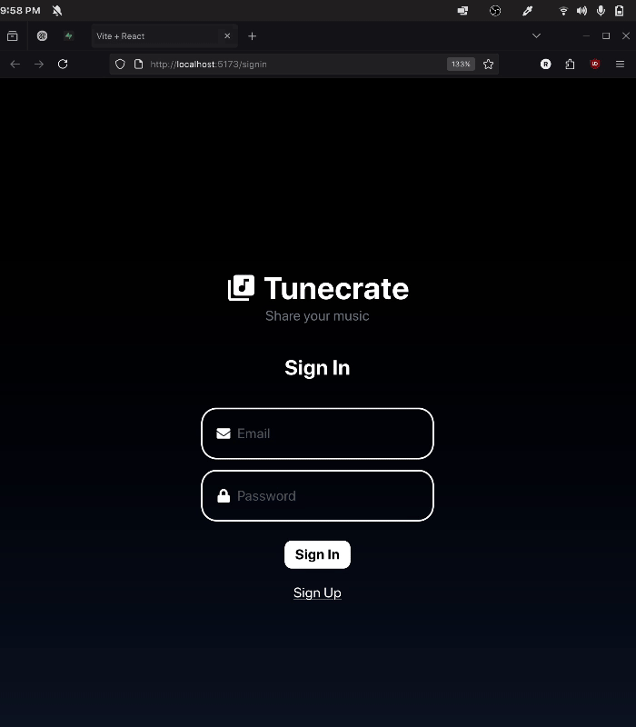

# Web Development Final Project - *Tunecrate*

Submitted by: **Rafael Niebles**

This web app: **Lets users publically review any song on Spotify, a bit like you can review movies on Letterboxd.**

Time spent: **12** hours spent in total

## Required Features

The following **required** functionality is completed:

- [x] **Web app includes a create form that allows the user to create posts**
    > Users can create reviews for any song on Spotify 
- [x] **Web app includes a home feed displaying previously created posts**
    > Songs with any ratings at all are displayed, showing their average star rating and rating count
- [x] **Users can view posts in different ways**
    > Users can search for individual songs and view such song's respective reviews
- [x] **Users can interact with each post in different ways**
    > Users are able to view each song's ratings, upvote, and edit depending on whether it was created by us
- [x] **A post that a user previously created can be edited or deleted from its post pages**

The following **optional** features are implemented:

- [x] Web app implements **FULL** authentication
    > Users can sign up via email and password for full auth w/Supabase
- [ ] Users can repost a previous post by referencing its post ID. On the post page of the new post
- [ ] Users can customize the interface
- [ ] Users can add more characterics to their posts
- [ ] Web app displays a loading animation whenever data is being fetched

The following **additional** features are implemented:

* [x] Dynamic search bar that autofetches track results from Spotify on input change 

## Video Walkthrough

[Video is long! Click here for FULL walkthrough](https://drive.google.com/file/d/1NRf_zgVt1i_laU9ZBwwuyoES1k4CBAJ-/view?usp=sharing)

GIF with first 30 seconds:

## Notes

Because of finals week, I only had a day to complete this before the extension deadline finished. I learned a LOT in the process, but it was really, really difficult! I wasn't able to get a lot of what I wanted in, but I'm happy I got to an MVP in such a short period of time :)

## License

    Copyright [2025] [Rafael Niebles]

    Licensed under the Apache License, Version 2.0 (the "License");
    you may not use this file except in compliance with the License.
    You may obtain a copy of the License at

        http://www.apache.org/licenses/LICENSE-2.0

    Unless required by applicable law or agreed to in writing, software
    distributed under the License is distributed on an "AS IS" BASIS,
    WITHOUT WARRANTIES OR CONDITIONS OF ANY KIND, either express or implied.
    See the License for the specific language governing permissions and
    limitations under the License.

